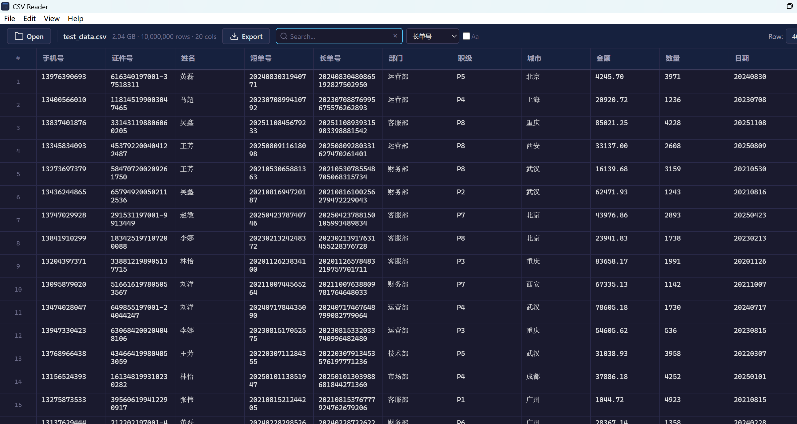
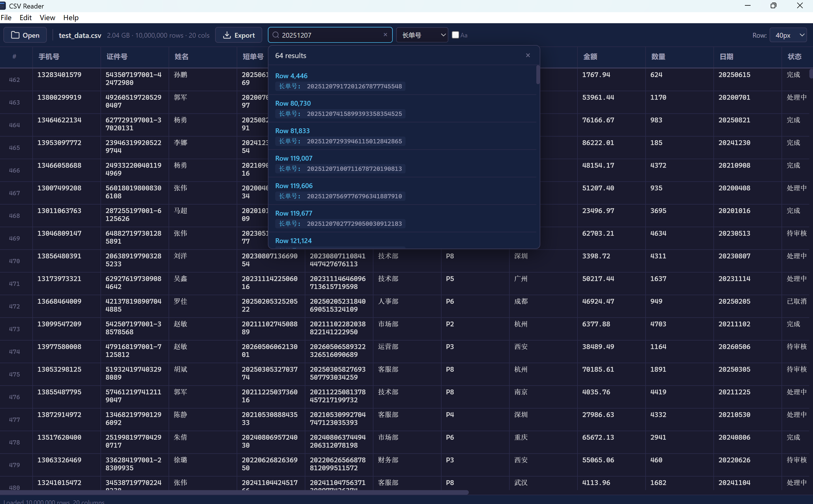

# CSV Reader

[English](README.md) | [简体中文](README.zh-CN.md)

A cross-platform desktop app for reading, searching, editing, and exporting large delimited-text files. CSV Reader uses Tauri 2 and Rust to keep multi-gigabyte files responsive without loading all file data into physical memory.



## Features

- Memory-mapped file access with an in-memory row-offset index
- Virtual scrolling that renders only visible rows
- Parallel, case-sensitive or case-insensitive search with column filtering
- Full-cell detail view with capped table previews for large values
- Row and column selection, cell editing, and continuous-range export
- Automatic delimiter detection for comma, tab, semicolon, and pipe
- UTF-8 and BOM-marked UTF-16 LE/BE input support



## Download and Install

Download platform packages from [GitHub Releases](https://github.com/fulracoco/csv_reader/releases).

### Windows

Use the `x64` installer on most PCs and `arm64` on Windows ARM devices. The standard installer can download WebView2 when required; the much larger `with.WebView2` package contains the offline runtime.

### macOS

Use `aarch64.dmg` on Apple Silicon (M1 or newer) and `x64.dmg` on Intel Macs. Current GitHub builds are not signed or notarized by Apple, so Gatekeeper may report that the developer cannot be verified or that the app is damaged.

After dragging **CSV Reader** to Applications, first Control-click the app and choose **Open**. If it is still blocked, run:

```bash
xattr -dr com.apple.quarantine "/Applications/CSV Reader.app"
```

Only bypass quarantine for packages downloaded from this repository's official Releases page.

### Linux

Choose the package matching your architecture: `.deb` for Debian-based distributions or `.AppImage` for a portable build. Make an AppImage executable before launching it:

```bash
chmod +x CSV.Reader_*.AppImage
```

## Usage

| Action | How |
|---|---|
| Open a file | Click **Open** or press `Ctrl/Cmd+O` |
| Search | Press `Ctrl/Cmd+F`, enter a query, choose a column, then press `Enter` |
| Inspect a cell | Click a cell to open the full-content panel |
| Edit a cell | Double-click a cell, or open it and click **Edit** |
| Select rows/columns | Click row numbers or headers; use Shift for a range and Ctrl/Cmd to toggle |
| Export | Click **Export**, choose columns and a continuous row range, then save |
| Change density | Choose a row height from the **Density** menu |

## Development

### Prerequisites

- [Node.js](https://nodejs.org/) 18 or later
- [Rust](https://www.rust-lang.org/tools/install) stable toolchain
- Platform dependencies required by [Tauri 2](https://v2.tauri.app/start/prerequisites/)

On Ubuntu/Debian, install the dependencies used by CI:

```bash
sudo apt install libwebkit2gtk-4.1-dev libgtk-3-dev \
  libayatana-appindicator3-dev librsvg2-dev libssl-dev \
  libsoup-3.0-dev libjavascriptcoregtk-4.1-dev xz-utils
```

### Run Locally

```bash
git clone https://github.com/fulracoco/csv_reader.git csv-reader
cd csv-reader
npm install
npm run dev
```

### Commands

| Command | Purpose |
|---|---|
| `npm run dev` | Start the Tauri development app |
| `npm run build` | Build a release package for the current platform |
| `npm run build:win` | Build Windows x64 |
| `npm run build:mac-x64` | Build macOS Intel |
| `npm run build:mac-arm64` | Build macOS Apple Silicon |
| `npm run build:linux` | Build Linux x64 |
| `npm version 0.1.14 --no-git-tag-version` | Update the single version source and sync npm/Cargo metadata |
| `npm run version:check` | Verify that all version metadata is consistent |
| `cargo test --manifest-path src-tauri/Cargo.toml` | Compile and run Rust tests |

## Architecture

| Path | Responsibility |
|---|---|
| `frontend/index.html` | Application layout and controls |
| `frontend/styles.css` | Theme, table, panels, and responsive layout |
| `frontend/renderer.js` | Virtual scrolling, interaction, search, editing, and export UI |
| `src-tauri/src/csv_engine.rs` | Memory mapping, indexing, parsing, caching, search, edit, and export |
| `src-tauri/src/commands.rs` | Tauri IPC commands, dialogs, and localized application menus |
| `src-tauri/src/lib.rs` | Application setup, plugins, state, and menu events |
| `.github/workflows/build.yml` | Cross-platform builds and GitHub Release publishing |

The file is memory-mapped, and a one-pass scan records each row's byte offset. Visible rows are parsed on demand and retained in a 500-row cache. Search scans rows in parallel without creating a persistent search index; the UI returns at most 500 matches.

## Performance Notes

- Tested with files larger than 2 GB and datasets containing 10 million rows.
- Row offsets use 4 bytes for files up to 4 GiB and 8 bytes for larger files, so 10 million rows require about 40 MB or 80 MB for the index.
- Export streams rows to a UTF-8 CSV with a BOM and does not retain the full export in memory.
- Editing streams a rewrite through a temporary file in the same directory and keeps only the target row in memory; replacement requires free disk space close to the source file size.
- Indexing and search speed depend on storage, encoding, row width, and CPU resources.

## License

MIT
