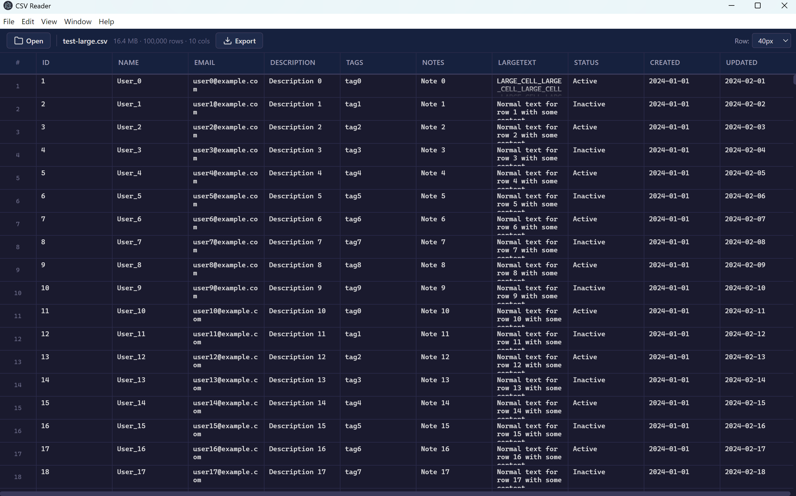

# CSV Reader

A cross-platform desktop application for reading and exporting large CSV files. Built with Tauri + Rust.

Handles files of any size (tested with 300MB+) by using memory-mapped byte-offset indexing in Rust — the entire file is never loaded into memory.



## Features

- **File-backed indexing** — scans the file once to build a byte-offset index, then reads only visible rows on demand
- **Virtual scrolling** — renders only rows in the viewport, smooth even with millions of rows
- **Large cell support** — cells containing several MB of text are handled efficiently: preview in table, full content in detail panel on click
- **Uniform column widths** — all columns have equal width with a 120px minimum; horizontal scrollbar appears when needed
- **Row/column selection** — click row numbers or column headers to select (Shift for range, Ctrl to toggle)
- **CSV export** — select columns and row range, export to a new CSV file with proper quoting and BOM for Excel compatibility
- **Dark theme** — easy on the eyes for long data sessions

## Prerequisites

- [Rust](https://www.rust-lang.org/tools/install) (stable toolchain)
- [Node.js](https://nodejs.org/) v18 or later
- Linux: `sudo apt install libwebkit2gtk-4.1-dev libgtk-3-dev libayatana-appindicator3-dev librsvg2-dev`

## Quick Start

```bash
git clone git@github.com:fulracoco/csv_reader.git
cd csv-reader
npm install
npm run dev
```

## Usage

| Action | How |
|---|---|
| Open file | Click **Open CSV File** or the folder icon, or `Ctrl+O` |
| Scroll | Mouse wheel / drag scrollbar (virtual scrolling, only visible rows loaded) |
| View cell content | Click any cell to open the detail panel on the right |
| Copy cell | Select cell, press `Ctrl+C`, or click **Copy** in the detail panel |
| Adjust row height | Use the dropdown in the toolbar (28px–100px) |
| Select rows | Click row numbers (Shift/Ctrl for multi-select) |
| Select columns | Click column headers (Shift/Ctrl for multi-select) |
| Export CSV | Click **Export** → choose columns + row range → save |

## Architecture

| File | Purpose |
|---|---|
| `src-tauri/src/csv_engine.rs` | Rust CSV engine: memory-mapped I/O, byte-offset indexing, LRU cache, parsing |
| `src-tauri/src/commands.rs` | Tauri IPC command handlers + i18n menu builder |
| `src-tauri/src/lib.rs` | Tauri app setup, plugin registration, menu event handling |
| `src-tauri/src/main.rs` | Entry point |
| `index.html` | UI layout: welcome screen, toolbar, virtual table, detail panel, export modal |
| `styles.css` | Dark theme, table styling, modal, scrollbar customization |
| `renderer.js` | Virtual scrolling engine, DOM pool recycling, cell interaction, export dialog |

### How It Handles Large Files

1. **Memory-mapped I/O** — the file is mapped into virtual memory (not read into RAM), so the OS handles paging transparently.
2. **One-pass indexing** — scans the file byte-by-byte in Rust, records row start positions. For 200K rows this takes ~100ms and uses ~1.5MB of memory.
3. **On-demand reading** — only rows visible in the viewport are read from the mmap (~30 rows).
4. **LRU cache** — 500 most recently accessed rows kept in memory.
5. **Truncated IPC** — only the first 500 characters of each cell are sent to the renderer. For a file with ~800KB cells, this reduces IPC transfer from 24MB to 30KB per viewport (99.9% reduction). Full content is loaded on demand when a cell is clicked.
6. **Streaming export** — writes directly to the output file row by row, never holds the full dataset in memory.

## Keyboard Shortcuts

| Key | Action |
|---|---|
| `Escape` | Close detail panel / clear selection |
| `Ctrl+C` | Copy selected cell content |

## License

MIT
